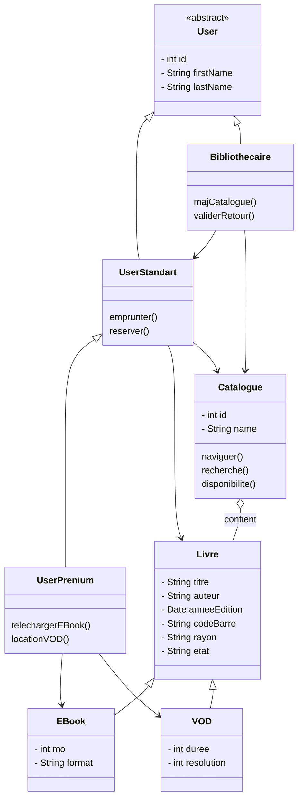
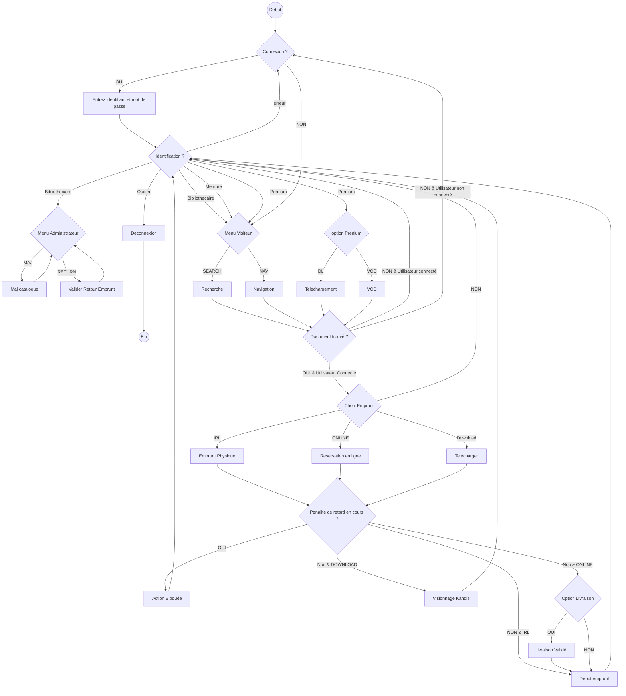
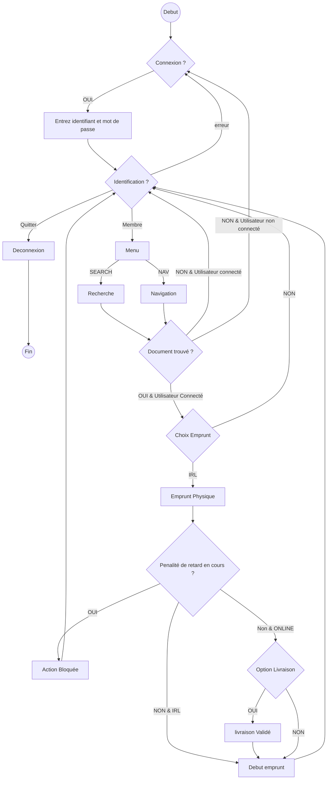

# Omnilib

## Diagramme de Cas d'Utilisation

## Diagramme de Classes

## Diagramme d'Activité

### Diagramme globale

### Diagramme Algorithme du processus de "Réservation en ligne d'un livre physique"

