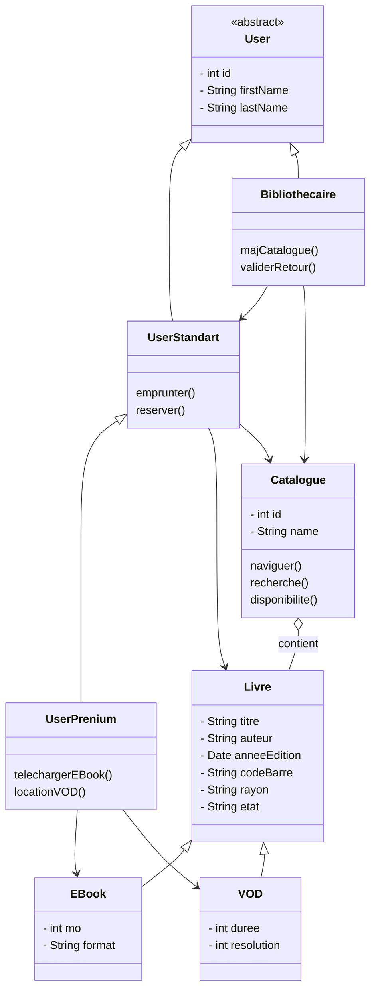

# Omnilib

## Diagramme de Cas d'Utilisation

## Diagramme de Classes

```mermaid
classDiagram

    Livre <|-- EBook
    Livre <|-- VOD
    User <|-- UserStandart
    UserStandart <|-- User Prenium
    User <|-- Bibliothecaire

    Catalogue o-- Livre : contient

    UserStandart --> Livre
    UserStandart --> Catalogue
    UserPrenium --> EBook
    UserPrenium --> VOD
    Bibliothecaire --> UserStandart
    Bibliothecaire --> Catalogue

 
    class Livre {
        - String titre
        - String auteur
        - Date anneeEdition
        - String codeBarre
        - String rayon
        - String etat
    }

    class EBook {
        - int mo
        - String format
    }

    class User {
        <<abstract>>
        - int id
        - String firstName
        - String lastName
    }

    class UserStandart {
        emprunter()
        reserver()
    }

    class UserPrenium {
        telechargerEBook()
        locationVOD()
    }

    class Bibliothecaire {
        majCatalogue()
        validerRetour()
    }

    class Catalogue {
        - int id
        - String name
        naviguer()
        recherche()
        disponibilite()
    }

    class VOD {
        - int duree
        - int resolution
    }

```

## Diagramme d'Activité